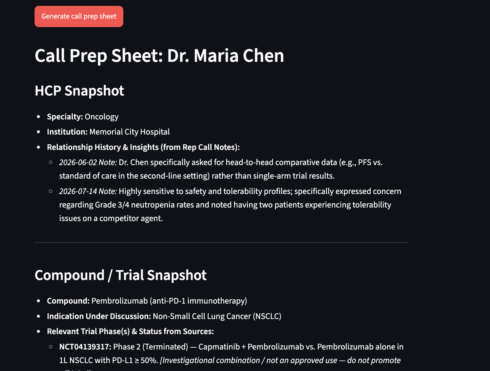

# Life Sciences Sales Copilot

A domain-specific RAG (Retrieval-Augmented Generation) application that helps pharmaceutical and biotech sales teams prepare for HCP (Healthcare Provider) interactions by combining clinical trial evidence with HCP-specific representative call history.

## Live Demo

[Launch the Life Sciences Sales Copilot](https://life-sciences-sales-copilot-nq46ptkaw7cfd9tn3yqgjy.streamlit.app/)

## Problem Statement

Pharmaceutical sales representatives and Medical Science Liaisons often need to prepare for HCP conversations using multiple sources of information, including clinical trial evidence and previous interactions with the HCP.

Generic CRM AI tools can summarize notes, but they may not provide the domain-specific context needed to connect:

- Clinical trial phases and status
- NCT identifiers
- Efficacy and safety topics
- HCP-specific questions and concerns
- Medical Affairs / MSL follow-up requirements

This project demonstrates how a domain-specific RAG pipeline can address this workflow.

## Solution

The Life Sciences Sales Copilot retrieves information from two complementary sources:

1. ClinicalTrials.gov for clinical trial evidence
2. CRM-style representative call notes for HCP-specific interaction history

The retrieved context is passed to Gemini 3.6 Flash, which generates a structured HCP call-preparation sheet.

The system is designed to ground clinical and relationship-specific claims in retrieved source material and identify information that is unavailable rather than inventing unsupported details.

## RAG Architecture

```text
                    ┌──────────────────────┐
                    │   ClinicalTrials.gov │
                    │         API          │
                    └──────────┬───────────┘
                               │
                               ▼
                    ┌──────────────────────┐
                    │   Trial Ingestion    │
                    └──────────┬───────────┘
                               │
                               ▼
                    ┌──────────────────────┐
                    │      ChromaDB        │
                    │  Vector Knowledge    │
                    │       Base           │
                    └──────────▲───────────┘
                               │
                               │
                    ┌──────────┴───────────┐
                    │                      │
                    │   Rep Call Notes     │
                    │      CSV / CRM       │
                    │                      │
                    └──────────────────────┘
                               │
                               ▼
                    ┌──────────────────────┐
                    │   Semantic Search    │
                    │                      │
                    │ • Clinical trials    │
                    │ • HCP-specific notes │
                    └──────────┬───────────┘
                               │
                               ▼
                    ┌──────────────────────┐
                    │   Gemini 3.6 Flash   │
                    │      Generation      │
                    └──────────┬───────────┘
                               │
                               ▼
                    ┌──────────────────────┐
                    │   HCP Call Prep      │
                    │       Sheet          │
                    └──────────────────────┘
````

## Example Use Case

**HCP:** Dr. Maria Chen
**Drug:** Pembrolizumab
**Condition:** Non-small cell lung cancer

The system retrieves relevant clinical trial records alongside historical representative notes for the specific HCP.

The generated preparation sheet includes:

* HCP Snapshot
* Compound / Trial Snapshot
* Key Data Points to Reference
* Likely Questions & Suggested Responses
* Suggested Talking Points
* Open Items / MSL Follow-up Needed
* Compliance Note
* Sources Used

This combines clinical evidence with HCP relationship context rather than simply summarizing a single document.

## Demo



The application generates an HCP-specific call preparation sheet using retrieved clinical trial evidence and representative interaction history.

## Tech Stack

| Component       | Technology                 |
| --------------- | -------------------------- |
| Frontend        | Streamlit                  |
| LLM             | Google Gemini 3.6 Flash    |
| RAG             | Custom Python RAG Pipeline |
| Vector Database | ChromaDB                   |
| Embeddings      | Sentence Transformers      |
| Embedding Model | all-MiniLM-L6-v2           |
| Clinical Data   | ClinicalTrials.gov API     |
| Rep Notes       | CSV / Pandas               |
| Language        | Python                     |
| Deployment      | Streamlit Community Cloud  |

## How It Works

### 1. Clinical Trial Ingestion

Clinical trial records are retrieved from the ClinicalTrials.gov API using the selected drug and condition.

### 2. Representative Note Ingestion

CRM-style representative call notes are loaded from:

```text
data/rep_notes_example.csv
```

Expected fields:

```text
hcp_name
hcp_specialty
institution
date
drug
topic
note_text
```

### 3. Embedding and Indexing

Clinical trial records and representative notes are transformed into vector embeddings using the `all-MiniLM-L6-v2` Sentence Transformer model.

The resulting vectors are stored in ChromaDB.

### 4. HCP-Specific Retrieval

For each call-preparation request, the system performs semantic retrieval for:

* Relevant clinical trial evidence
* Historical notes associated with the selected HCP

HCP metadata filtering ensures that unrelated HCP notes are not included in the retrieved context.

### 5. Grounded Generation

The retrieved context is passed to Gemini 3.6 Flash.

The prompting layer instructs the model to:

* Ground clinical claims in retrieved sources
* Distinguish clinical trial evidence from representative notes
* Identify unavailable information
* Flag investigational or potentially off-label content
* Identify questions requiring MSL / Medical Affairs follow-up

### 6. Source Transparency

The application displays the clinical trial and representative-note sources retrieved for the generated call-preparation sheet.

## Compliance-Aware Design

This project is a **prototype / portfolio demonstration**, not a production pharmaceutical system.

The application includes safeguards designed to:

* Ground clinical claims in retrieved evidence
* Identify unavailable information rather than fabricate details
* Distinguish clinical trial evidence from representative notes
* Flag investigational or potentially off-label uses
* Route complex scientific questions toward MSL / Medical Affairs review
* Display an MLR compliance reminder

No patient-level health information is included in the example dataset.

Generated content must undergo appropriate **Medical, Legal, and Regulatory (MLR) review** before external use.

## Key Differentiators

### Domain-Specific RAG

The retrieval workflow is designed around pharmaceutical and clinical-trial terminology rather than generic document question-answering.

### HCP-Specific Context

Representative notes are filtered by HCP so previous questions, concerns, and interaction history can influence call preparation.

### Evidence-Grounded Generation

The model receives retrieved clinical and interaction data before generating the response and is instructed to identify information that is not available in the retrieved sources.

### Compliance-Aware Workflow

The system distinguishes clinical evidence, representative notes, and investigational content while identifying potential MSL / Medical Affairs follow-up requirements.

### Extensible Architecture

The same architecture can be extended to support:

* Veeva CRM integration
* Salesforce Life Sciences Cloud integration
* PubMed literature retrieval
* Internal compound databases
* Additional clinical data sources
* Enterprise vector databases
* Human-in-the-loop MLR review

## Project Structure

```text
life-sciences-sales-copilot/
│
├── README.md
├── demo.png
├── requirements.txt
├── .env.example
├── build_index.py
├── app.py
│
├── data/
│   └── rep_notes_example.csv
│
└── src/
    ├── __init__.py
    ├── ingest_trials.py
    ├── ingest_notes.py
    ├── vectorstore.py
    ├── prompts.py
    └── generate_call_prep.py
```

## Future Enhancements

* CRM API integration
* Automated HCP profile enrichment
* More granular clinical trial endpoint extraction
* PubMed integration
* Retrieval and generation evaluation metrics
* Authentication and role-based access
* Audit logging
* Human-in-the-loop MLR review
* Enterprise deployment architecture

## Disclaimer

This project is a portfolio prototype demonstrating RAG, clinical-data retrieval, and life-sciences workflow design.

It is not intended to provide medical advice or replace qualified Medical Affairs, Legal, Regulatory, or clinical expertise.

Generated content should not be treated as approved promotional material and must undergo appropriate review before external use.

```

*
